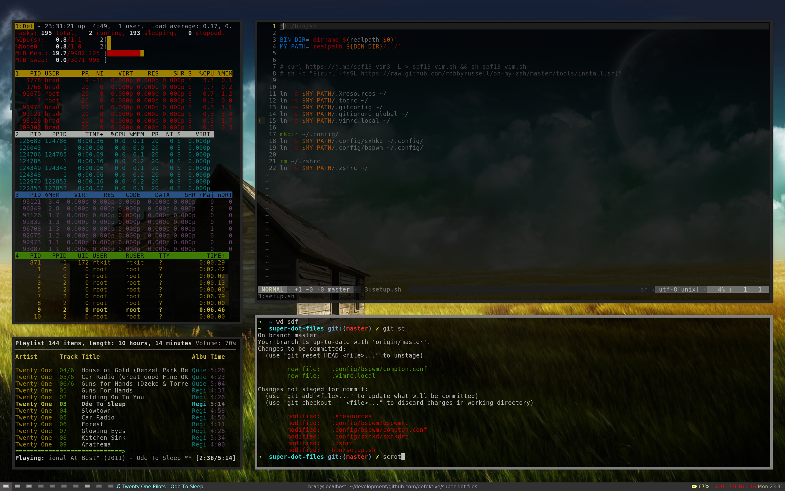

# super dot files

Currently using fedora with the following

- [bspwm](https://github.com/baskerville/bspwm)
- [sxhkd](https://github.com/baskerville/sxhkd)
- [krypt-n patched lemonbar](https://github.com/krypt-n/bar)
- lightdm
- mpd

